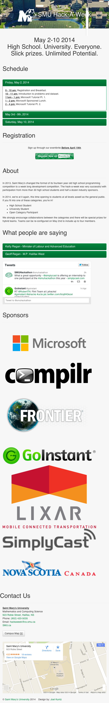
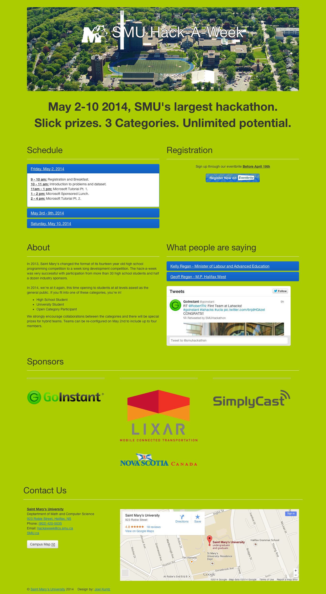

# Saint Mary's University Hack-A-Week 2014 Website

View the current [hosted version](http://cs.smu.ca/hackaweek). Or the latest on [github pages](http://smuhackaweek.github.io/SMU-Hack-A-Week-2014/).  

## Usage

Simply open the `index.html` file in your web browser.

**Optional:** You could simply use Python.

```bash
python -m SimpleHTTPServer
```

## Screenshots

To generate these screenshots see [Pageres](https://github.com/sindresorhus/pageres).

Start a server
([Pageres](https://github.com/sindresorhus/pageres) requires a server to host files)
and then:

```bash
cd screenshots/ # Change into the Screenshots directory
pageres http://127.0.0.1:8000/ 1366x768 640x1136 # Create two screenshots of the app
```

### Mobile (iPhone, 640x1136)


### Desktop (1366x768)

